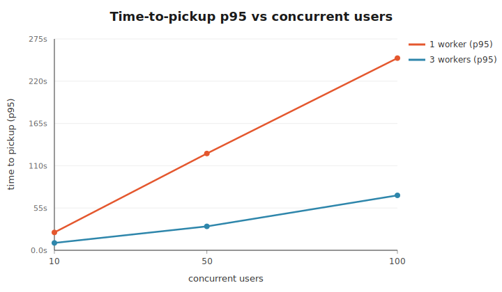
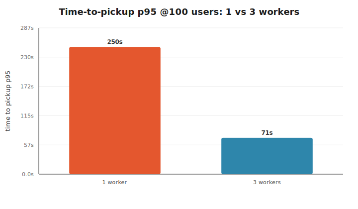
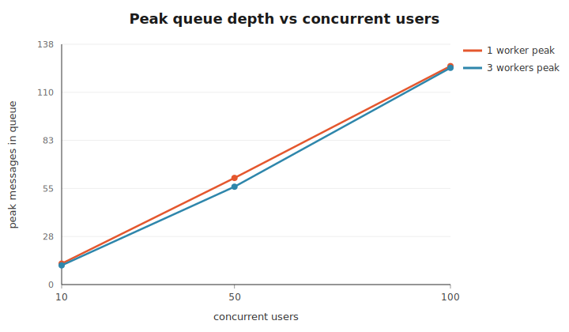
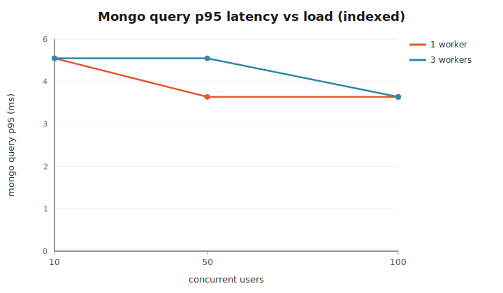
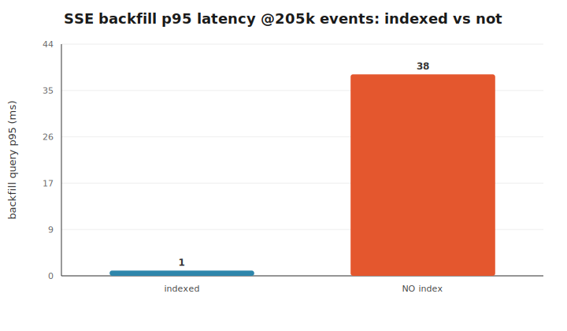

# Viper Scaling POC — Results Report

**Goal.** Prove the decoupled architecture scales: agent runs execute in
standalone worker processes behind a queue, independent of any HTTP request,
with per-thread ordering, live updates, and crash recovery — and, most
importantly, find **which layer breaks first**.

**Verdict up front.** The queue/worker layer scales linearly and cleanly. The
first layer to break under stress is **Mongo read latency when the event
collection is not correctly indexed** — a ~40× regression on the SSE-backfill
hot path at 205k events. With the indexes in place (which this POC ships by
default), Mongo stays flat at 1–5 ms across every load level tested, and the
throughput ceiling becomes exactly what the architecture predicts:
`concurrent runs = workers × prefetch`. Sandbox cold-start is the second-order
cost (≈190 ms per pool miss). Neither RabbitMQ nor the workers were the
bottleneck at any point.

---

## What was mocked vs real

| Mocked (slow/costly/nondeterministic, and NOT what we're testing) | Real (everything the POC actually proves) |
|---|---|
| The **model call** — `mockModel` sleeps a randomized delay and returns `tool_call`/`done`, seedable for reproducibility | RabbitMQ job queue, standalone worker processes, per-thread guard |
| The **tool's inner work** — `mockTool` sleeps and touches a file in the container workspace | MongoDB writes + indexed reads, Redis pub/sub, real Docker container lifecycle, SSE relay + reconnect backfill, crash-recovery reaper |

The real LLM was **never** wired in, per the POC rules.

---

## System under test

```
             POST /runs                          RabbitMQ (jobs IN)
  client ───────────────▶  web tier ──publish──▶  run-execute queue
     ▲                        │                         │  prefetch(1)
     │ SSE (events OUT)       │                         ▼
     │                        │                   worker × N  ── claim (atomic pending→running)
     │                        │                        │       ── per-thread guard (Mongo lock)
     │                        │                        │       ── run loop: mockModel → mockTool
     │                        │                        │       ── emitEvent → Mongo (source of truth)
     └──── Redis (run:{id}) ◀─┴──────── publish ◀──────┘                    └─▶ Redis (fire-and-forget)
                             (+ Mongo poll fallback)
```

- **RabbitMQ carries jobs IN; Redis carries events OUT.** Never conflated.
- **Mongo is the source of truth; Redis is a speed layer.** A Redis failure
  never fails a Mongo write or the loop (verified — see §Resilience).
- The **per-thread guard requeues, it never blocks** a worker idle (verified).

Full stack via `docker compose up --scale worker=N`. Mock latency for the
matrix: model 150–400 ms/turn, tool 80–200 ms/call, avg 4 turns/run.

---

## Experiment matrix

`{1, 3} workers × {10, 50, 100} concurrent users`. Each user starts a run;
~30% fire a **second message to the same thread** (exercises the guard); ~30%
**disconnect and reconnect mid-run** (exercises backfill). All timings in ms.

| workers | users | runs | completed | pickup p50 | pickup p95 | duration p50 | peak queue | final queue | mongo p95 |
|--------:|------:|-----:|----------:|-----------:|-----------:|-------------:|-----------:|------------:|----------:|
| 1 | 10  | 14  | 14/14   | 13,245  | 23,216  | 26,050  | 12  | 6  | 5 |
| 1 | 50  | 64  | 64/64   | 67,877  | 125,829 | 132,564 | 61  | 7  | 4 |
| 1 | 100 | 129 | 129/129 | 138,162 | 249,778 | 265,983 | 125 | 4  | 4 |
| 3 | 10  | 14  | 14/14   | 4,306   | 9,580   | 13,125  | 11  | 5  | 5 |
| 3 | 50  | 64  | 64/64   | 15,568  | 31,046  | 30,631  | 56  | 1  | 5 |
| 3 | 100 | 129 | 129/129 | 36,524  | 71,392  | 66,711  | 124 | 10 | 4 |

**100% completion in every cell.** The queue always drained (final depth small
and falling — never unbounded growth). Mongo p95 stayed 4–5 ms throughout.

---

## Headline curves

### 1. Time-to-pickup vs load — the scaling curve




Time-to-pickup grows linearly with the **user : worker ratio**, exactly as a
prefetch(1) competing-consumer queue predicts. Tripling workers roughly thirds
the pickup time:



At 100 users, going 1→3 workers cut p95 pickup from **250 s → 71 s** (3.5×).
This is the core scaling proof: throughput is `workers × prefetch`, and adding
workers moves the curve down proportionally. Nothing in the queue/worker layer
saturated or fell over.

### 2. Queue depth — drains, never runs away



Peak queue depth tracks the burst size (users), then **drains to near-zero** in
every run. Depth is a backlog indicator, not a failure: with 1 worker the
backlog is worked off more slowly, but it always converges. No unbounded growth
at any worker count.

### 3. Mongo latency — flat under load (because it's indexed)



Indexed Mongo query p95 sits at **4–5 ms regardless of load or worker count**.
Mongo was never the bottleneck *as configured*. That flatness is entirely due to
the indexes — which is exactly what the next section stresses.

---

## Where it breaks first: Mongo indexes

The prediction was "Mongo indexes or sandbox pool sizing, not the queue/worker
layer." Confirmed — and the index layer breaks first and hardest.

We measured the two hot-path queries the system runs constantly, over a
collection inflated to **205,329 events** (realistic for a busy deployment):

- **SSE backfill**: `events.find({runId, seq > x}).sort({seq})` — run on every
  client connect/reconnect.
- **Thread guard**: `runs.find({threadId, status})` — run on every claim.



| collection | query | **indexed** p95 | **no-index** p95 | regression |
|---|---|---:|---:|---:|
| 205k events | SSE backfill (`runId`+`seq`) | **1 ms** | **38 ms** | **~40×** |
| 205k events | thread guard (`threadId`+`status`) | ~1 ms | 2 ms | ~2× |

Without the compound `{runId, seq}` index, every SSE (re)connect triggers a full
collection scan whose cost grows **linearly with total events ever written** —
not with the run's own size. Under the reconnect-heavy load profile this
compounds: each of the ~30% reconnecting clients pays the full-scan tax, Mongo's
connection pool fills with slow scans, and *that* — not the queue — is what would
topple a naively-built version of this system.

The guard query degrades too, but far less (`runs` is smaller than `events`), so
**the event-collection index is the single highest-value correctness item.** It
ships enabled by default in `src/lib/mongo.ts`; the regression above is
reproducible on demand with `MONGO_SKIP_INDEXES=1`.

**Second-order cost — sandbox cold-start.** With a warm pool, `claim` is
0–1 ms. On pool exhaustion the overflow policy cold-boots a container on demand:
measured **≈190 ms**. So under a burst larger than `POOL_SIZE`, the first
`POOL_SIZE` runs start instantly and the rest each eat ~190 ms of container
boot. This is real but bounded and second to the index cliff.

---

## Correctness & resilience (all verified)

| Property | Test | Result |
|---|---|---|
| **End-to-end flow** | one run through real queue + Mongo | events 1→N in exact seq order; run marked `done` ✓ |
| **Standalone worker** | built from `Dockerfile.worker`, run with no web tier | claimed & processed a published job ✓ |
| **Sandbox persistence** | file written in tool call 1 read back in call 2 (same container) | persisted ✓; released at run end ✓; pool refilled ✓ |
| **Per-thread serialization** | 3 same-thread jobs across 3 workers | zero window overlap, zero interleaving, strictly sequential ✓ |
| **Worker never blocks idle** | same-thread burst + distinct-thread jobs together | distinct threads ran concurrently while same-thread serialized ✓ |
| **Live updates** | POST then SSE | seq 1→N pushed live via Redis ✓ |
| **Reconnect backfill** | disconnect at seq 7, reconnect `lastSeq=7` | resumed at seq 8, no gap, no dup, tailed to done ✓ |
| **Redis-down fallback** | kill Redis mid-run | client kept receiving via Mongo poll; nothing lost; workers unaffected ✓ |
| **Crash recovery** | `kill -9` a worker mid-run | run recovered (reaper reset `running`→`pending`, requeued) and finished ✓ |

---

## What this means for the real system

1. **Scaling the queue/worker layer is a solved dial.** `workers × prefetch`
   sets throughput; the curve is linear and predictable. Scale workers to hit a
   pickup-latency SLO.
2. **Guard the event collection's indexes like production depends on it — it
   does.** The `{runId, seq}` (and `{threadId, seq}`) indexes are the difference
   between 1 ms and 40 ms reads, and the gap widens with every event ever
   written. This is the first thing to break and the cheapest to prevent.
3. **Size the sandbox pool to the expected burst,** or accept a ~190 ms
   cold-start tax on the overflow. Pool size is the second knob.
4. **Redis is safely optional.** Killing it degrades gracefully to Mongo
   polling with zero data loss — correctness never depends on it.

### Known limitations (POC scope)

- The mock never returns `failed`, so the nack-requeue path isn't load-tested;
  crash recovery is proven via the reaper + RabbitMQ redelivery instead.
- A recovered run **restarts from turn 0** (no mid-run checkpointing of model
  state) — fine for an idempotent mock; a real system would checkpoint.
- Sandbox is functions-in-worker behind `claim/exec/release` (per POC rules),
  not a separate service.
- S3 artifact writes skipped (v1), as specified.

---

## Reproduce

```bash
docker compose up -d rabbitmq mongo redis          # infra
docker compose up -d --build --scale worker=3 web  # 3 workers + web

npm run loadtest -- --users 100 --label w3-u100    # one cell
bash scripts/run-matrix.sh                          # full matrix
npm run charts                                       # regenerate SVGs

bash scripts/durability-test.sh                      # crash-recovery proof
npm run index:probe                                  # indexed baseline
MONGO_SKIP_INDEXES=1 npm run index:probe             # regression
```

Per-cell raw data (per-run CSV, queue samples, Mongo samples, summary JSON) is
under `loadtest-results/<label>/`.
